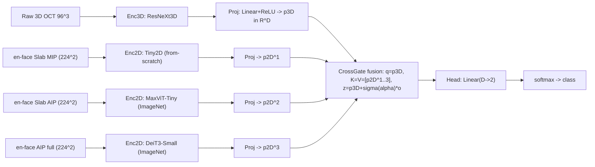

# Thiết kế mô hình 4 nhánh (1×3D + 3×2D) từ kết quả 3 sweep

Tổng hợp từ 3 báo cáo:
- [`3d-backbone-sweep.md`](3d-backbone-sweep.md) — sweep backbone 3D (17 run).
- [`2d-feature-extraction-sweep.md`](2d-feature-extraction-sweep.md) — sweep trích xuất đặc trưng 2D (6 run).
- [`fusion-ablation-sweep.md`](fusion-ablation-sweep.md) — ablation 6 phép fusion 2D–3D.

**Mục tiêu:** ghép **nhánh 3D mạnh nhất** + **3 nhánh 2D mạnh nhất (theo 3 view en-face)** bằng cơ chế fusion
đã khảo sát, kèm quy trình huấn luyện chống collapse và đánh giá nhiều seed.

---

## 1. Bằng chứng chọn thành phần (từ 3 sweep)

| Thành phần | Chọn | Bằng chứng | Thay thế |
|---|---|---|---|
| Nhánh 3D | **ResNeXt3D @96³** | test AUC **85,38%**, PR-AUC **87,98%**, F1 **78,36%**, bal-acc **77,19%**, MCC **0,542** (đầu bảng 3D) | VNet (ECE tốt hơn 3,46%), SegResNet (val mạnh), 3DINO (pretrained) |
| Nhánh 2D — view **Slab MIP** | **Tiny2D (from-scratch)** | Slab MIP là view tốt nhất; Tiny2D-SlabMIP test AUC 0,7242, F1 **0,7195**, ECE **0,0549**, chỉ 4,12 phút | MaxViT |
| Nhánh 2D — view **Slab AIP** | **MaxViT-Tiny (ImageNet)** | Backbone 2D mạnh nhất: test AUC **0,7638**, PR-AUC 0,7925, MCC **0,3765** | DeiT3 |
| Nhánh 2D — view **AIP toàn ảnh** | **DeiT3-Small (ImageNet)** | Ổn định, calibration tốt (ECE 0,0568), test AUC 0,6988, MCC 0,3040 | ConvNeXtV2 (đang suy biến) |
| Fusion | **CrossGate** (chính) + **Attention** (đối chứng) | Ablation: CrossGate test AUC cao nhất (0,5685); Attention ổn định nhất (giảm 0,0252 sau đỉnh) | Mamba (val cao, test bét), FiLM |
| Head | `Linear(D→2)` + CrossEntropy (class weights) | chuẩn phân loại nhị phân | focal loss |

> **Lưu ý quan trọng:** ablation fusion trước đây **collapse** vì nhánh 2D dùng `convnextv2_tiny` — backbone **đã suy biến**
> trong sweep 2D (MCC = 0, Recall = 0). Vì vậy thiết kế này **thay nhánh 2D bằng các backbone đã kiểm chứng**
> (MaxViT / Tiny2D / DeiT3). Đây là sửa lỗi gốc, không phải đổi fusion.

---

## 2. Kiến trúc mô hình 4 nhánh

- Sơ đồ CrossGate chi tiết: [`multiview-model.md`](multiview-model.md) mục 8 và `figures/model_crossgate.png`.
- 4 nhánh = **1 nhánh 3D + 3 nhánh 2D** (mỗi nhánh một view en-face), giống `MultiViewModel` nhưng thay backbone.
- Chiều fusion `D` (ví dụ 256); head `Linear(D→2)`.

### Cấu hình đề xuất

| Thành phần | Giá trị |
|---|---|
| Input 3D | **96³** (resize on-the-fly từ raw 200³), `/255` |
| Input 2D | **224×224** cho cả 3 view (AIP full / Slab AIP / Slab MIP) |
| Nhánh 3D | ResNeXt3D (`resxt3d`), out-dim 192 |
| Nhánh 2D | Tiny2D (from-scratch) · MaxViT-Tiny (ImageNet) · DeiT3-Small (ImageNet) |
| Fusion | CrossGate (chính) / Attention (đối chứng), `D=256` |
| Batch / effective | bs 2 + grad-accum (effective ≥16), AMP (bf16) |
| Optim | AdamW, warmup 5% + cosine, early-stop theo **val AUC/PR-AUC** |
| Class imbalance | class weights hoặc focal loss; threshold chọn trên val |

---

## 3. Quy trình huấn luyện (bắt buộc, chống collapse)

1. **Cùng protocol:** cùng train/val/test split, cùng preprocessing, cùng số epoch/early-stop cho mọi biến thể.
2. **Backbone pretrained:** **freeze → unfreeze** theo giai đoạn (2D trước, 3D sau) để tránh phá vỡ pretrain.
3. **Giám sát collapse mỗi epoch:** log **balanced accuracy & MCC**; nếu bal-acc ≈ 0.5 / MCC ≈ 0 → dừng và sửa
   (LR, class weights, warmup).
4. **Chọn checkpoint theo val AUC/PR-AUC**, không theo test accuracy; giữ test độc lập.
5. **Calibration:** temperature scaling (hoặc isotonic) trên val trước khi báo cáo (MaxViT có ECE cao).
6. **Nhiều seed:** ≥ **3–5 seed** → báo cáo **mean ± std** (và bootstrap CI nếu được).
7. **Log thống nhất:** acc, balanced acc, AUC, PR-AUC, F1, MCC, sensitivity, specificity, ECE (+ time, params).

---

## 4. Mục tiêu & baseline tham chiếu

| Nguồn | Chỉ số tốt nhất hiện có |
|---|---|
| 3D tốt nhất (ResNeXt3D) | test AUC **0,854** · PR-AUC 0,880 · F1 0,784 · bal-acc 0,772 · MCC 0,542 |
| 2D tốt nhất (MaxViT) | test AUC 0,764 · PR-AUC 0,793 · MCC 0,377 |
| 2D cân bằng nhất (Tiny2D-SlabMIP) | test AUC 0,724 · F1 0,720 · ECE 0,055 |

**Kỳ vọng:** mô hình 4 nhánh phải **≥ nhánh 3D tốt nhất** (AUC ≥ 0,854) và cải thiện **calibration** (ECE ≤ ~0,05),
đồng thời **không collapse** (bal-acc > 0,75, MCC > 0,5). Nếu fusion không vượt single-3D ⇒ chứng minh 2D **không bổ trợ**.

---

## 5. Rủi ro & việc cần làm

- **Fusion từng collapse** → đã xử lý bằng cách thay nhánh 2D; vẫn phải giám sát bal-acc/MCC.
- **Single-seed** ở cả 3 sweep → cần 3–5 seed trước khi kết luận.
- **Confound protocol:** `denoise-enc-32-d5` (200³+NLM) chưa so được cùng protocol.
- **Chi phí:** 4 nhánh nặng hơn single-3D; giữ 3D ở 96³, cache view 2D để giảm chi phí.
- **Ensemble bổ sung (tuỳ chọn):** trung bình xác suất `mô hình 4 nhánh + MaxViT(2D) + ResNeXt3D(3D)` để tăng ổn định.

---

## 6. Đoạn mô tả dùng trong báo cáo

> Từ kết quả ba khảo sát độc lập, chúng tôi thiết kế mô hình **bốn nhánh** gồm một nhánh 3D (**ResNeXt3D** @96³)
> và ba nhánh 2D theo ba biểu diễn en-face (**Slab MIP** – Tiny2D, **Slab AIP** – MaxViT-Tiny, **AIP toàn ảnh** – DeiT3-Small),
> hợp nhất bằng cơ chế **CrossGate** (nhánh 3D làm query, các token 2D làm key/value, cộng dư qua cổng học được).
> Các backbone 2D/3D được chọn theo bằng chứng thực nghiệm (AUC/PR-AUC/balanced-accuracy/MCC), **không** theo accuracy đơn thuần,
> và **thay thế nhánh 2D đã suy biến** (`convnextv2_tiny`) trong cấu hình fusion trước đó. Mô hình được huấn luyện với
> class weighting, chọn checkpoint theo validation AUC/PR-AUC, hiệu chỉnh xác suất, và đánh giá trên ≥3 seed để báo cáo mean ± std.
