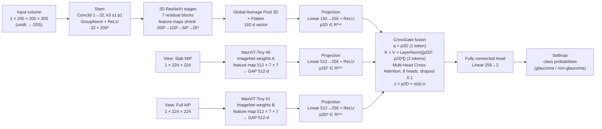

# Draw Prompt — Hybrid 3D/2D CNN + Cross-Attention Architecture (English, detailed)

> Use this document as the input prompt/specification for a diagramming tool (draw.io, Mermaid,
> PowerPoint, Illustrator, or an image-generation model). It describes the model **actually
> implemented** in `scripts/final_model.py` (`FinalModel`) and trained by
> `notebooks/3d_glaucoma_final_2x2d_3d_crossgate.ipynb`.

---

## 0. One-line drawing instruction

> **Draw a hybrid CNN–Transformer architecture for 3D OCT glaucoma classification, left to right:
> from the input image/volume through convolution and pooling layers (feature maps shrinking along the
> 3D branch) and through two 2D transformer branches, to flattened feature vectors, projection layers,
> a cross-attention fusion gate (CrossGate), and finally a fully connected layer ending in a softmax
> classifier. Label every layer with its type and output feature-map size, and show the feature-map
> sizes shrinking along the way.**

---

## 1. High-level layout

- Direction: **left → right**.
- Three input lanes at the left:
  - **Top lane:** raw 3D OCT volume `1 × 200 × 200 × 200`.
  - **Bottom two lanes:** two en-face 2D views (`slab MIP` and `full AIP`), each `1 × 224 × 224`.
- Each lane has its own encoder:
  - Top: **3D CNN** encoder (`ResNeXt3D`) — convolution + pooling, feature maps shrink `200³ → 100³ → 50³ → 25³`.
  - Bottom: **2D transformer** encoders (`MaxViT-Tiny ×2`, independent weights).
- All three encoders emit a 1-D feature vector, each projected to `D = 256`.
- The three projected tokens merge in **CrossGate** (multi-head cross-attention + learned gate).
- The fused `256-d` vector goes to a **fully connected head** `Linear(256→2)` and then **softmax**.
- Total: **≈ 58.30 M parameters**.

---

## 2. Block diagram (Mermaid)



---

## 3. Branch A — 3D CNN encoder (`Enc3DResNeXt`)

Draw this as a vertical stack of shrinking feature maps. Label each layer and its output size.

| Step | Layer (type + config) | Output feature-map size | Notes |
|---:|---|---|---|
| 0 | **Input volume** | `1 × 200 × 200 × 200` | raw OCT, scaled `/255` |
| 1 | **Stem:** `Conv3d(1→32, k=3, s=1, p=1)` | `32 × 200 × 200 × 200` | + GroupNorm(8) + ReLU |
| 2 | **ResXBlock3D #1** (identity) | `32 × 200 × 200 × 200` | no downsampling |
| 3 | **ResXBlock3D #2** (`stride 2×2×2`) | `64 × 100 × 100 × 100` | feature map shrinks |
| 4 | **ResXBlock3D #3** (identity) | `64 × 100 × 100 × 100` | |
| 5 | **ResXBlock3D #4** (`stride 2×2×2`) | `128 × 50 × 50 × 50` | feature map shrinks |
| 6 | **ResXBlock3D #5** (identity) | `128 × 50 × 50 × 50` | |
| 7 | **ResXBlock3D #6** (`stride 2×2×2`) | `192 × 25 × 25 × 25` | feature map shrinks |
| 8 | **ResXBlock3D #7** (identity) | `192 × 25 × 25 × 25` | |
| 9 | **Global Average Pooling 3D** | `192 × 1 × 1 × 1` | collapse spatial dims |
| 10 | **Flatten** | `192` | 1-D embedding `e3d` |

**Inside one `ResXBlock3D`** (pre-activation residual, grouped convolutions, `groups = 8`):
1. `Conv3d(cin → width, k=1)` → GroupNorm → ReLU
2. `Conv3d(width → width, k=3, stride=s, pad=1, groups=8)` → GroupNorm → ReLU
3. `Conv3d(width → cout, k=1)` → GroupNorm
4. Shortcut: `Conv3d(cin → cout, k=1, stride=s)` + GroupNorm when `stride ≠ 1` or `cin ≠ cout`, else identity
5. Add shortcut + residual → **ReLU**

**Feature-map shrink summary (label along the branch):**
`200³ → 200³ → 100³ → 100³ → 50³ → 50³ → 25³ → 25³ → pooled 1³`.

---

## 4. Branches B & C — 2D transformer encoders (`Timm2D × 2`)

Two **independent** copies of `maxvit_tiny_rw_224` (ImageNet-pretrained), one per en-face view.
Draw each as a small transformer tower ending in a pooled vector.

| Step | Layer (type + config) | Output size |
|---:|---|---|
| 0 | **Input view** (Slab MIP or Full AIP) | `1 × 224 × 224` |
| 1 | **MaxViT patch/stem embedding** | `64 × 56 × 56` (representative) |
| 2 | **MaxViT blocks** (MBConv + block/window/dilated attention) | downsampled: `224 → 112 → 56 → 28 → 14 → 7` |
| 3 | **Final feature map** | `512 × 7 × 7` |
| 4 | **Global Average Pooling (2D)** | `512 × 1 × 1` |
| 5 | **Flatten** | `512` (1-D embedding `e2d`) |

- The two branches use **separate weights** (no weight sharing).
- Fallback: if the backbone does not accept `in_chans=1`, it is created with `in_chans=3` and the single
  channel is repeated to 3 before the network.

---

## 5. Projection layers (`Proj × 3`)

Draw three small `Linear + ReLU` boxes between the encoders and the fusion block.

| Projection | Input | Layer | Output token |
|---|---|---|---|
| `projs[0]` | 3D embedding `192` | `Linear(192→256) + ReLU` | `p3D ∈ R²⁵⁶` |
| `projs[1]` | 2D embedding #0 `512` | `Linear(512→256) + ReLU` | `p2D¹ ∈ R²⁵⁶` |
| `projs[2]` | 2D embedding #1 `512` | `Linear(512→256) + ReLU` | `p2D² ∈ R²⁵⁶` |

Stack into a token matrix: **`3 × 256`** = `[p3D, p2D¹, p2D²]`.

---

## 6. Fusion — CrossGate (cross-attention + gate)

Draw as one highlighted box with the following internals and equation.

| Component | Configuration | Role |
|---|---|---|
| `LayerNorm` | over `D = 256` | normalize the two 2D tokens |
| `MultiheadAttention` | `embed_dim=256`, **8 heads**, `dropout=0.1`, `batch_first=True` | cross-attention |
| `gate` | learnable scalar `α`, initialized `0.5` | gate `σ(α)` |

Formulas to print inside the box:
```
q = p3D                 (1 query token)
K = V = LayerNorm([p2D¹; p2D²])   (2 key/value tokens)
o = MultiHeadCrossAttention(q, K, V)
z = p3D + σ(α) · o      (residual gate; σ(0.5) = 0.622)
```
Output: **`z ∈ R²⁵⁶`**. The 3D branch is the main path; the 2D signals only modulate it through the gate.

---

## 7. Classification head & softmax

| Step | Layer | Output |
|---:|---|---|
| 1 | **Fully connected** `Linear(256 → 2)` | `logits (2)` |
| 2 | **Softmax** | class probabilities `[P(non-glaucoma), P(glaucoma)]` |

Train with `CrossEntropyLoss` (class-weighted). The head returns **raw logits**; softmax is shown as the
final block for interpretation.

---

## 8. Full tensor shape table

| Tensor | Shape | Where |
|---|---|---|
| `x3d` | `(B, 1, 200, 200, 200)` | 3D input |
| `views` | `(B, 2, 1, 224, 224)` | 2D inputs (`[slab_mip, aip_full]`) |
| `e3d` | `(B, 192)` | 3D embedding |
| `e2d⁰`, `e2d¹` | `(B, 512)` | 2D embeddings |
| `toks` | `(B, 3, 256)` | `[p3D, p2D¹, p2D²]` |
| `o` | `(B, 1, 256)` | cross-attention output |
| `z` | `(B, 256)` | fused embedding |
| `logits` | `(B, 2)` | head output |

---

## 9. Edge list (arrows for the drawing tool)

| # | From → To | Label on arrow |
|---:|---|---|
| 1 | Input volume → Stem | `1 × 200³` |
| 2 | Stem → 3D ResNeXt stages | `32 × 200³` |
| 3 | 3D stages → Global Average Pool 3D | `192 × 25³` |
| 4 | Global Average Pool 3D → Projection `projs[0]` | `192` |
| 5 | Slab MIP view → MaxViT-Tiny #0 | `1 × 224²` |
| 6 | Full AIP view → MaxViT-Tiny #1 | `1 × 224²` |
| 7 | MaxViT #0 → Projection `projs[1]` | `512` |
| 8 | MaxViT #1 → Projection `projs[2]` | `512` |
| 9 | `projs[0]` → CrossGate (query) | `p3D, 256` |
| 10 | `projs[1]` → CrossGate (key/value) | `p2D¹, 256` |
| 11 | `projs[2]` → CrossGate (key/value) | `p2D², 256` |
| 12 | CrossGate → Head | `z, 256` |
| 13 | Head → Softmax | `logits, 2` |

---

## 10. Layer labels to print on the figure

- **Input:** `Input 3D OCT (1×200×200×200)`; `View: Slab MIP (1×224×224)`; `View: Full AIP (1×224×224)`.
- **3D branch:** `Conv3d 1→32 k3 s1 + GroupNorm + ReLU`; `ResNeXt Block (32)`; `ResNeXt Block (32→64, s2)`;
  `ResNeXt Block (64→128, s2)`; `ResNeXt Block (128→192, s2)`; `Global Average Pool 3D`; `Flatten (192)`.
- **2D branches:** `MaxViT-Tiny (ImageNet)`; `Global Average Pool 2D`; `Flatten (512)`.
- **Projection:** `Linear(192→256)+ReLU`; `Linear(512→256)+ReLU`.
- **Fusion:** `LayerNorm`; `Multi-Head Cross-Attention (8 heads)`; `Gate σ(α)`; `z = p3D + σ(α)·o`.
- **Head:** `Fully Connected (256→2)`; `Softmax`.

---

## 11. Style guide (suggested)

- **Colors:** 3D branch `#dbe9f6` (border `#1f4e79`); 2D branches `#d9ead3` (border `#38761d`);
  projections `#cfe2f3`; CrossGate `#f4cccc`; head/softmax `#fff2cc`; input `#ffe599`.
- **Grouping:** draw a light container around each encoder (`enc3d`, `enc2ds`), around the projections
  (`projs`), around the fusion (`CrossGate`), and around the head.
- **Feature-map shrinking:** show the 3D feature maps as stacked cubes that get smaller left→right
  (`200³ → 100³ → 50³ → 25³`); show the 2D feature maps as square grids shrinking `224 → 112 → 56 → 28 → 14 → 7`.
- **Arrow labels:** always include the tensor shape.
- **Total params callout:** `≈ 58.30 M` (3D 0.64 M + 2D 57.08 M + projections 0.31 M + fusion 0.26 M + head 0.0005 M).

---

## 12. Important accuracy notes (do not draw these wrong)

1. **The `(2,2,1)` stride is NOT applied.** The constructor accepts
   `strides=((2,2,1),(2,2,2),(2,2,2),(2,2,2))`, but the loop applies a stride only when `i > 0`,
   so the first element is unused and the first stage is an identity block. Verified by a real forward
   pass: **stem stride 1 → 200³, then three stride-(2,2,2) stages → 100³ → 50³ → 25³.**
2. **Two 2D branches are independent** (separate MaxViT-Tiny weights); `n_2d` is configurable (1 or 2).
3. **Token order** in CrossGate: query = 3D token; key/value = the two 2D tokens.
4. **Residual fusion:** `z = p3D + σ(α)·o` (3D is the main path; 2D modulates through the gate).
5. **Raw logits** `(B,2)` are used with `CrossEntropyLoss` (no sigmoid inside the model).
6. Input size 3D is `200³` (`RES3D`, smoke-test uses `96³`); input size 2D is `224²` (`RES2D`).

---

## 13. Training configuration (caption for the figure)

| Item | Value |
|---|---|
| Optimizer | AdamW, lr `2e-4`, weight decay `1e-4` |
| Schedule | warmup 5% + cosine |
| Batch / effective | batch `2` + grad-accum `8` (effective `16`), AMP `bf16` |
| Epochs / early stop | `30`, patience `6` |
| Checkpoint | best **validation AUC** |
| Calibration | temperature scaling |
| Seeds | `42, 43, 44` |
| Loss | `CrossEntropyLoss` with class weights |

---

## 14. Sources

- Code: `scripts/final_model.py` (`FinalModel`, `Enc3DResNeXt`, `ResXBlock3D`, `Timm2D`, `Proj`, `CrossGate`).
- Notebook: `notebooks/3d_glaucoma_final_2x2d_3d_crossgate.ipynb`.
- Summary: `docs/model-architecture.md`; detailed Vietnamese spec: `docs/model-architecture-spec.md`.
- Reference figure: `figures/model_final_2x2d_3d_crossgate.png`.
