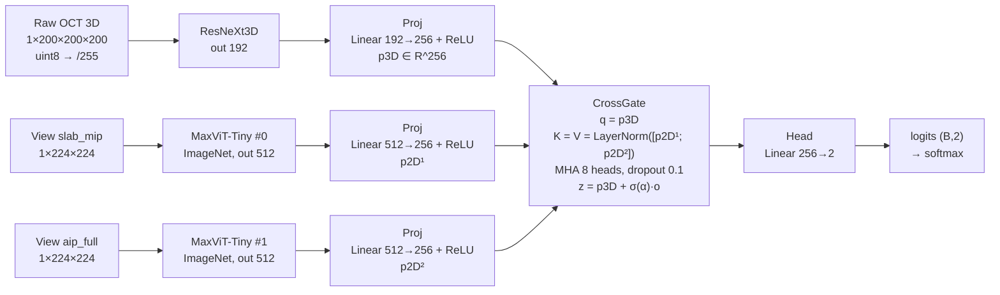

# Đặc tả kiến trúc mô hình chính (2×2D + 1×3D + CrossGate) — bản chi tiết để vẽ hình

Tài liệu này **đặc tả chi tiết** mô hình đang được triển khai trong code để đưa vào phần mềm vẽ sơ đồ
(draw.io / Mermaid / PowerPoint / Illustrator). Kiến trúc lấy **trực tiếp từ code**:
`scripts/final_model.py` (class `FinalModel`) và được dùng bởi notebook
`notebooks/3d_glaucoma_final_2x2d_3d_crossgate.ipynb`.

> Tham chiếu nhanh: [`model-architecture.md`](model-architecture.md) (bản tóm tắt).
> Bản này đặc tả **đúng hành vi code** (bao gồm cả điểm stride không dùng — xem mục 11).

---

## 1. Tổng quan một đoạn

Phân loại nhị phân glaucoma từ OCT 3D. Mô hình gồm **3 nhánh song song**:
**1 nhánh 3D** trích đặc trưng thể tích (`ResNeXt3D`, out-dim 192) và **2 nhánh 2D** trích đặc trưng ảnh
en-face (`MaxViT-Tiny`, mỗi view một bản riêng, out-dim 512). Ba vector đặc trưng được chiếu về
`D = 256` rồi hợp nhất bằng **CrossGate** (cross-attention 1 query 3D × 2 key/value 2D + cổng học được).
Vector hợp nhất `z` đi qua head `Linear(256→2)` cho logits; huấn luyện bằng `CrossEntropyLoss` có class weight.
Tổng **58,30 M tham số**.

- 2 view 2D: **`slab_mip`** (MIP dải quanh đỉnh phản xạ) và **`aip_full`** (trung bình toàn chiều sâu).
- 2 nhánh 2D **độc lập** (không chia sẻ trọng số).
- Nhánh 3D là **đường chính**; nhánh 2D chỉ điều chỉnh qua cổng residual `σ(α)`.

---

## 2. Sơ đồ khối tổng thể

### 2.1. Mermaid (nếu phần mềm hỗ trợ)



Thứ tự token: `[p3D, p2D¹, p2D²]` trên trục token (3 token).

### 2.2. Sơ đồ ASCII (layout gợi ý vẽ)

```
                 ┌───────────────────────┐    ┌──────────────────┐    ┌─────────────────────────┐
Raw 3D OCT ────► │ ResNeXt3D (Enc3D)     │──► │ Proj 192→256     │──► │                         │
(1×200³, /255)   │ GroupNorm residual     │    │ Linear + ReLU    │    │                         │
                 │ out-dim = 192          │    │ p3D ∈ R^256      │──► │                         │
                 └───────────────────────┘    └──────────────────┘    │                         │
                                                                       │       CrossGate         │
View slab_mip ──►┌───────────────────────┐    ┌──────────────────┐    │  q = p3D (1 token)      │    ┌────────────┐   ┌──────────┐
(1×224²)         │ MaxViT-Tiny #0         │──► │ Proj 512→256     │──► │  K=V=LN(p2D¹,p2D²)      │──► │ Head       │──►│ logits   │
                 │ (ImageNet, weights A)  │    │ Linear + ReLU    │    │  MHA 8 heads, do=0.1    │    │ 256→2      │   │ (B,2)    │
                 └───────────────────────┘    └──────────────────┘    │  z=p3D+σ(α)·o           │    └────────────┘   └──────────┘
                                                                       │                         │
View aip_full ──►┌───────────────────────┐    ┌──────────────────┐    │                         │
(1×224²)         │ MaxViT-Tiny #1         │──► │ Proj 512→256     │──► │                         │
                 │ (ImageNet, weights B)  │    │ Linear + ReLU    │    └─────────────────────────┘
                 └───────────────────────┘    └──────────────────┘
```

---

## 3. Đặc tả từng khối

### 3.1. Nhánh 3D — `Enc3DResNeXt` (`FinalModel.enc3d`)

Đầu vào `x3d`: `(B, 1, 200, 200, 200)` float32 trong `[0,1]`. Đầu ra: `(B, 192)`.

**Stem** (`enc3d.stem`)
| Bước | Layer | Cấu hình | Output shape |
|---|---|---|---|
| 1 | `Conv3d` | in 1 → out 32, kernel 3, stride 1, pad 1, bias=False | (B, 32, 200, 200, 200) |
| 2 | `GroupNorm` | 8 groups, 32 ch | (B, 32, 200, 200, 200) |
| 3 | `ReLU` | — | (B, 32, 200, 200, 200) |

**Thân** (`enc3d.stages`, `nn.ModuleList` gồm **7 block** theo thứ tự)

| # | Block (`ResXBlock3D`) | in→out | stride | spatial out |
|---|---|---|---|---|
| 1 | `stages[0]` | 32 → 32 | (1,1,1) | 200³ |
| 2 | `stages[1]` | 32 → 64 | **(2,2,2)** | 100³ |
| 3 | `stages[2]` | 64 → 64 | (1,1,1) | 100³ |
| 4 | `stages[3]` | 64 → 128 | **(2,2,2)** | 50³ |
| 5 | `stages[4]` | 128 → 128 | (1,1,1) | 50³ |
| 6 | `stages[5]` | 128 → 192 | **(2,2,2)** | 25³ |
| 7 | `stages[6]` | 192 → 192 | (1,1,1) | 25³ |

**Pooling** (`enc3d.pool`): `AdaptiveAvgPool3d(1)` → `flatten(1)` → `(B, 192)`.

**Bên trong 1 `ResXBlock3D`** (pre-activation residual; `groups=8`, `base_width=8` ⇒ `width = cout`):
| Bước | Layer | Cấu hình | Ghi chú |
|---|---|---|---|
| a | `c1` `Conv3d` | cin → width(=cout), k=1, bias=False | |
| b | `g1` GroupNorm + ReLU | 8 groups | |
| c | `c2` `Conv3d` | width → width, k=3, stride=(sx,sy,sz), pad=1, **groups=8**, bias=False | depthwise-grouped |
| d | `g2` GroupNorm + ReLU | 8 groups | |
| e | `c3` `Conv3d` | width → cout, k=1, bias=False | |
| f | `g3` GroupNorm | 8 groups | |
| g | Shortcut | nếu `stride≠(1,1,1)` hoặc `cin≠cout`: `Conv3d(cin→cout, k=1, stride)` + GroupNorm; ngược lại **identity** | |
| h | Add + ReLU | `out = ReLU(shortcut(x) + residual)` | |

> Lưu ý: ReLU được đặt **trước** `c2` và `c3` (kiểu pre-activation); ReLU cuối sau phép cộng.

### 3.2. Nhánh 2D — `Timm2D` × 2 (`FinalModel.enc2ds`)

Hai bản **độc lập** của `timm` model `maxvit_tiny_rw_224` (pretrained ImageNet). Đầu vào mỗi nhánh:
`views[:, i]` shape `(B, 1, 224, 224)`. Đầu ra mỗi nhánh: `(B, 512)`.

| Thuộc tính | Giá trị |
|---|---|
| Backbone | MaxViT-Tiny (`maxvit_tiny_rw_224`), `num_classes=0`, `global_pool="avg"`, `in_chans=1` |
| Pretrained | ImageNet (bật khi train thật; tắt ở smoke) |
| Trọng số | **Độc lập** giữa 2 nhánh (không tie weights) |
| out_dim | `net.num_features` = **512** |
| Fallback 1-channel | nếu timm không nhận `in_chans=1`, tạo bằng `in_chans=3` rồi `x.repeat(1,3,1,1)` |

### 3.3. Projection — `Proj` × 3 (`FinalModel.projs`)

| Proj | Áp dụng cho | Cấu hình | Vào → Ra |
|---|---|---|---|
| `projs[0]` | token 3D | `Linear + ReLU` | 192 → 256 |
| `projs[1]` | token 2D #0 (`slab_mip`) | `Linear + ReLU` | 512 → 256 |
| `projs[2]` | token 2D #1 (`aip_full`) | `Linear + ReLU` | 512 → 256 |

Gộp: `toks = stack([proj(e)], dim=1)` → `(B, 3, 256)`, thứ tự `[3D, 2D⁰, 2D¹]`.

### 3.4. Fusion — `CrossGate` (`FinalModel.fusion`)

Đầu vào: `c3 = toks[:,0]` `(B,256)`; `toks2d = toks[:,1:]` `(B,2,256)`. Đầu ra: `z` `(B,256)`.

| Thành phần | Cấu hình | Vai trò |
|---|---|---|
| `norm` | `LayerNorm(256)` | chuẩn hoá token 2D |
| `attn` | `MultiheadAttention(embed_dim=256, num_heads=8, dropout=0.1, batch_first=True)` | cross-attention |
| `gate` | `Parameter` vô hướng, khởi tạo `0.5` | cổng học được `σ(α)` |

Công thức:
```
q = c3.unsqueeze(1)                 # (B, 1, 256)
h = LayerNorm(toks2d)               # (B, 2, 256)
o, w = attn(q, h, h)                # o: (B, 1, 256); w: attention weights
z = c3 + sigmoid(gate) * o.squeeze(1)   # (B, 256)
```
- `sigmoid(0.5) = 0.6225` tại khởi tạo.
- `w` và giá trị `σ(α)` được lưu (`fusion.last_w`, `fusion.last_gate`) để trực quan hoá (X-AI).

### 3.5. Head — `FinalModel.head`

| Layer | Cấu hình | Ra |
|---|---|---|
| `Linear` | 256 → 2 | logits `(B, 2)` |

Loss: `CrossEntropyLoss(weight=class_weights)` (không dùng sigmoid/BCE).

---

## 4. Shapes xuyên suốt

| Tensor | Shape | Ghi chú |
|---|---|---|
| `x3d` | `(B, 1, 200, 200, 200)` | raw/255 hoặc đã resize về `RES3D` |
| `views` | `(B, 2, 1, 224, 224)` | `[slab_mip, aip_full]` |
| `e3d` | `(B, 192)` | output nhánh 3D |
| `e2d⁰`, `e2d¹` | `(B, 512)` | output mỗi nhánh 2D |
| `toks` | `(B, 3, 256)` | `[p3D, p2D⁰, p2D¹]` |
| `o` | `(B, 1, 256)` | cross-attention output |
| `z` | `(B, 256)` | fused embedding |
| `logits` | `(B, 2)` | đầu ra |

---

## 5. Danh sách kết nối (edge list cho phần mềm vẽ)

| # | From | To | Nhãn |
|---|---|---|---|
| 1 | Input 3D | Stem (Conv3d+GN+ReLU) | `(B,1,200,200,200)` |
| 2 | Stem | stages[0..6] | `(B,32,200³) → (B,192,25³)` |
| 3 | stages[6] | AdaptiveAvgPool3d(1)+Flatten | `(B,192,25³)` |
| 4 | Pool | Proj[0] | `(B,192)` |
| 5 | View `slab_mip` | MaxViT-Tiny #0 | `(B,1,224,224)` |
| 6 | View `aip_full` | MaxViT-Tiny #1 | `(B,1,224,224)` |
| 7 | MaxViT #0 | Proj[1] | `(B,512)` |
| 8 | MaxViT #1 | Proj[2] | `(B,512)` |
| 9 | Proj[0] | CrossGate (query) | `p3D (B,256)` |
| 10 | Proj[1] | CrossGate (key/value) | `p2D⁰ (B,256)` |
| 11 | Proj[2] | CrossGate (key/value) | `p2D¹ (B,256)` |
| 12 | CrossGate | Head | `z (B,256)` |
| 13 | Head | Softmax | `logits (B,2)` |
| 14 | CrossGate | (residual nội bộ) | `z = p3D + σ(α)·o` |

---

## 6. Số tham số (đo từ code)

| Thành phần | Chi tiết | Params |
|---|---|---:|
| Nhánh 3D `enc3d` | ResNeXt3D, ch 32→64→128→192, out 192 | 640.736 (~0,64 M) |
| Nhánh 2D `enc2ds` | MaxViT-Tiny ×2 (độc lập) | 28,54 M ×2 = ~57,08 M |
| Projection `projs` | Linear(192→256) + 2×Linear(512→256) | 312.064 (~0,31 M) |
| Fusion `fusion` | LayerNorm + MHA(8 heads) + gate | 263.681 (~0,26 M) |
| Head `head` | Linear(256→2) | 514 |
| **Tổng** | | **~58,30 M** |

---

## 7. Cấu hình huấn luyện đang chạy (từ notebook)

| Mục | Giá trị |
|---|---|
| Input 3D | raw **200³** (`RES3D=200`; smoke=96) |
| Input 2D | **224×224** (`RES2D=224`) |
| Dataset | `raw` + `bilateral` (khử nhiễu bilateral, lưu local/Drive) |
| Batch / effective | `BS=2`, `GRAD_ACCUM=8` (effective 16), AMP **bf16** |
| Optimizer | AdamW, `LR=2e-4`, `WD=1e-4` |
| Schedule | warmup 5% + cosine |
| Epochs / early-stop | 30, `PATIENCE=6` |
| Loss | CrossEntropyLoss + class weights |
| Chọn checkpoint | best **validation AUC** (không dùng epoch cuối) |
| Calibration | temperature scaling (fit trên val) |
| Threshold | chọn trên val |
| Seeds | 42, 43, 44 |
| Gradient clipping | `clip_grad_norm_ = 1.0` |
| Norm layer | GroupNorm (3D), BatchNorm nội bộ của MaxViT (2D) |

---

## 8. Tiền xử lý & view

- 3D: đọc `uint8 [0,255]` → `/255.0` (minmax). Nếu khác `RES3D` thì `F.interpolate(..., mode="trilinear")`
  (cast float **trước** khi interpolate).
- View 2D (`project_views`):
  - Xác định trục depth `dz` = trục có `std` lớn nhất; chuyển về depth-last.
  - `slab_mip` = MIP của dải `[peak-half, peak+half]` quanh đỉnh profile trung bình (mặc định `half=16`).
  - `aip_full` = trung bình toàn chiều sâu.
  - Resize về `224×224`.
- Augmentation (train): lật ngang/dọc, xoay `k×90°`, scale cường độ `U(0.9,1.1)`, shift `U(-8,8)` —
  áp **đồng bộ** giữa volume 3D và các view 2D.

---

## 9. X-AI gắn kèm (để vẽ phụ lục)

| Kỹ thuật | Module đích | Ghi chú |
|---|---|---|
| Grad-CAM 3D | conv cuối `enc3d.stages[-1]` | `gcam3d_module()` |
| Grad-CAM 2D | conv cuối mỗi `enc2ds[i]` | `gcam2d_module(i)` |
| Occlusion sensitivity | vol 3D (lưới `n³`) | `occlusion_sensitivity` |
| Integrated Gradients | vol 3D | `integrated_gradients` |
| CrossGate attention | `fusion.attn` (weights `w`) | `crossgate_attention` |
| Branch-drop | zero từng nhánh | `branch_drop_importance` |

---

## 10. Gợi ý layout & màu cho phần mềm vẽ

- **Hướng:** trái → phải. Input ở trái, logits ở phải.
- **3 làn ngang:** làn trên = nhánh 3D; 2 làn dưới = 2 nhánh 2D (chồng dọc, cùng cấp).
- **Gom nhóm (swimlanes/containers):**
  - Khung xanh dương `enc3d` (3D branch).
  - Khung xanh lá `enc2ds` (2D branches ×2).
  - Khung xám `projs` (Projection).
  - Khung đỏ/hồng `fusion` (CrossGate).
  - Khung cam `head`.
- **Màu gợi ý:** 3D `#dbe9f6` (viền `#1f4e79`); 2D `#d9ead3` (viền `#38761d`);
  Proj `#cfe2f3`; Fusion `#f4cccc`; Head `#fff2cc`; Input `#ffe599`.
- **Nhãn trên mũi tên:** ghi shape (`(B,1,200³)`, `(B,192)`, `(B,3,256)`, `(B,256)`, `(B,2)`).
- **Trong khối CrossGate** ghi rõ 4 dòng: `q = p3D (1 token)`; `K = V = LayerNorm(p2D¹..²) (2 tokens)`;
  `Multi-Head Cross-Attention (8 heads)`; `z = p3D + σ(α)·o`.
- **Chú thích nhánh 3D:** ghi downsampling thực tế `200³ → 100³ → 50³ → 25³` (3 lần stride 2).

---

## 11. Ghi chú quan trọng khi vẽ (để không vẽ sai)

1. **Stride (2,2,1) KHÔNG được dùng.** Constructor `Enc3DResNeXt` nhận
   `strides=((2,2,1),(2,2,2),(2,2,2),(2,2,2))` nhưng vòng lặp chỉ áp stride khi `i > 0`,
   nên phần tử `(2,2,1)` (stage đầu) bị bỏ qua; stage đầu là block identity. Downsampling thực tế:
   **stem stride 1 → 200³; rồi 3 lần (2,2,2) → 100³ → 50³ → 25³.** (Đã kiểm chứng bằng forward thật.)
2. **Số nhánh 2D cấu hình được:** `FinalModel(n_2d=1 hoặc 2)`. Bản đang chạy là `n_2d=2`.
3. **Hai nhánh 2D độc lập**, không chia sẻ trọng số (2 instance riêng của MaxViT-Tiny).
4. **Thứ tự token** trong CrossGate: query = 3D; key/value = 2D (2 token). `z = p3D + σ(α)·o`
   (nhánh 3D là đường chính, 2D chỉ điều chỉnh).
5. **Head trả raw logits** `(B,2)` + `CrossEntropyLoss` (không sigmoid).
6. Kích thước ảnh 2D **224** (bội của patch 16 không bắt buộc với MaxViT nhưng cấu hình đang dùng là 224).

---

## 12. Nguồn & liên kết

- Code: `scripts/final_model.py` (`FinalModel`, `Enc3DResNeXt`, `ResXBlock3D`, `Timm2D`, `Proj`, `CrossGate`).
- Notebook: `notebooks/3d_glaucoma_final_2x2d_3d_crossgate.ipynb`.
- Tóm tắt kiến trúc: [`model-architecture.md`](model-architecture.md).
- Hình tham khảo: `figures/model_final_2x2d_3d_crossgate.png`
  (vẽ lại bằng `python scripts/render_final_model_diagram.py`).
