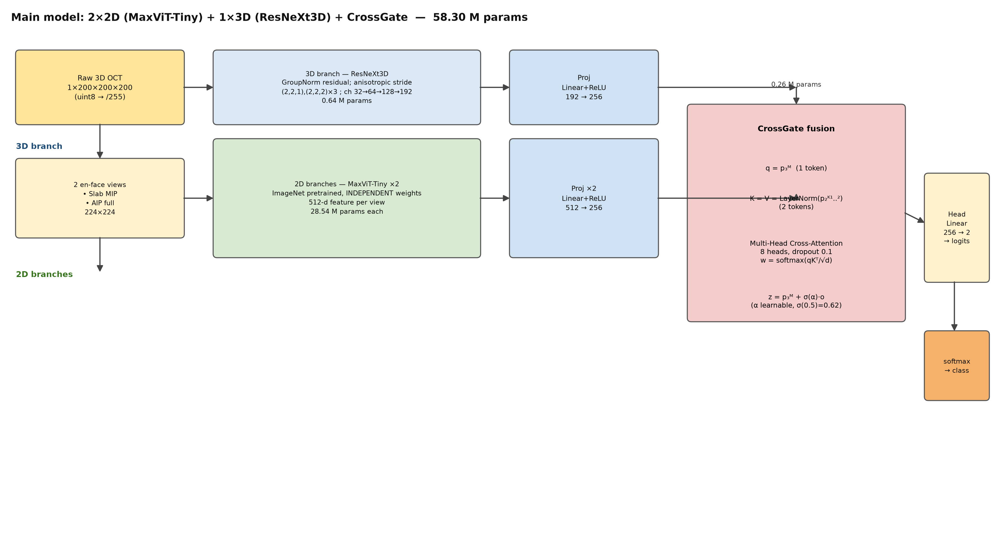
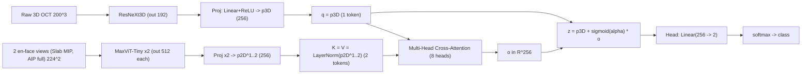

# Kiến trúc mô hình chính (2×2D + 1×3D + CrossGate)

Mô hình phân loại glaucoma từ OCT 3D: **1 nhánh 3D (ResNeXt3D @200³)** + **2 nhánh 2D (MaxViT-Tiny @224²)**,
hợp nhất bằng **CrossGate**. Nguồn: `scripts/final_model.py` (`FinalModel`).

*Vẽ lại:* `python scripts/render_final_model_diagram.py` → `figures/model_final_2x2d_3d_crossgate.png`.

## 1. Số tham số (đo trực tiếp từ code)

| Thành phần | Chi tiết | Params |
|---|---|---:|
| Nhánh 3D | ResNeXt3D: GroupNorm residual, stride `(2,2,1),(2,2,2)×3`, ch `32→64→128→192`, out-dim 192 | **0.64 M** |
| Nhánh 2D ×2 | MaxViT-Tiny (ImageNet, trọng số độc lập), view `slab_mip` + `aip_full`, out-dim 512 | **28.54 M ×2** |
| Projection | `Linear+ReLU` cho 3 token → D=256 | 0.31 M |
| Fusion | CrossGate: Multi-Head Cross-Attention 8 heads, gate α học được | 0.26 M |
| Head | `Linear(256 → 2)` | 0.00 M |
| **Tổng** | | **58.30 M** |

## 2. Luồng dữ liệu

- `q = p₃D` (shape `(B,1,256)`); `K = V = LayerNorm(p₂D^{1..2})` (shape `(B,2,256)`).
- `w = softmax(qKᵀ/√d)`; `o = Σⱼ wⱼ Vⱼ`; `z = p₃D + σ(α)·o`, `σ(0.5)=0.622`.
- `logits = Linear(256→2)(z)`; mất mát `CrossEntropyLoss` (có class weights).

## 3. Shapes (kiểm chứng bằng forward thật)

| Tensor | Shape |
|---|---|
| `x3d` | `(B, 1, 200, 200, 200)` |
| `views` | `(B, 2, 1, 224, 224)` |
| `p3D` / `p2D^i` | `(B, 256)` |
| `z` | `(B, 256)` |
| `logits` | `(B, 2)` |

## 4. Vì sao CrossGate (và không dùng self-attention 3 token)

CrossGate để **nhánh 3D "hỏi" nhánh 2D** (query = token 3D, key/value = token 2D) và giữ nhánh 3D làm
đường chính qua residual; nhánh 2D chỉ **điều chỉnh qua cổng** `σ(α)` chứ không thay thế. Điều này phù hợp
khi nhánh 3D là mạnh nhất (ResNeXt3D dẫn đầu sweep 3D) và 2D đóng vai trò bổ trợ.

## 5. Ghi chú

- 2 nhánh 2D (`slab_mip`, `aip_full`) được chọn theo phân tích trùng lặp view
  ([`view-redundancy-analysis.md`](view-redundancy-analysis.md)): `slab_aip` bán trùng lặp nên bỏ.
- Khử nhiễu đầu vào (mặc định **bilateral**) là tiền xử lý; mô hình giữ nguyên kiến trúc cho cả tập raw và denoised.
- Checkpoint chọn theo **validation AUC/PR-AUC**; hiệu chỉnh bằng temperature scaling khi báo cáo.
