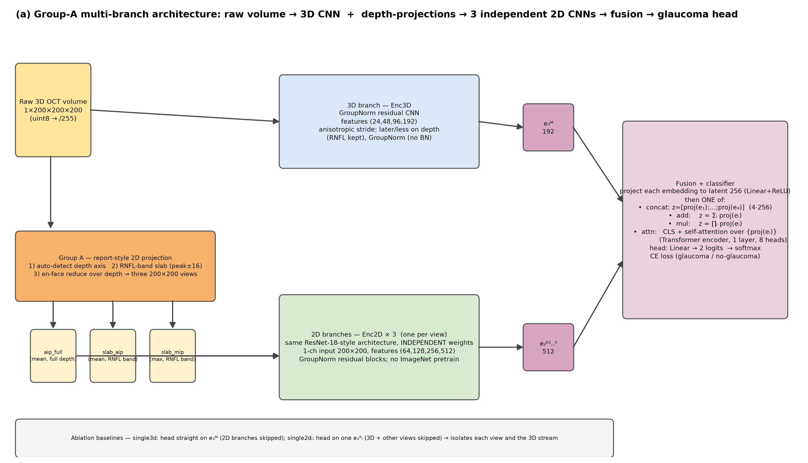
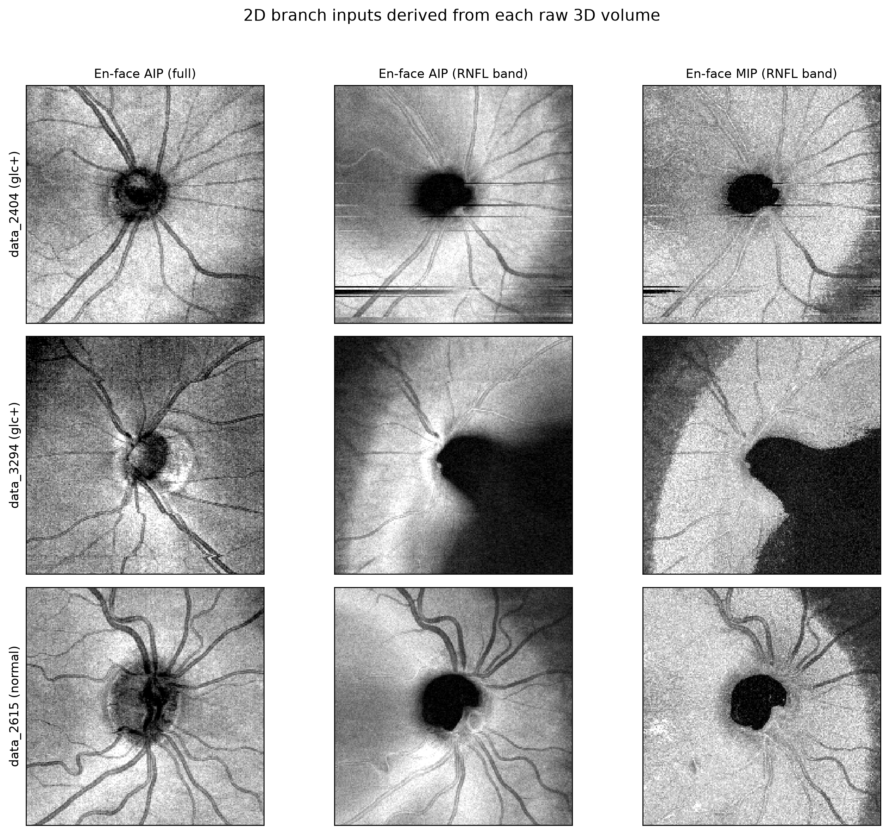
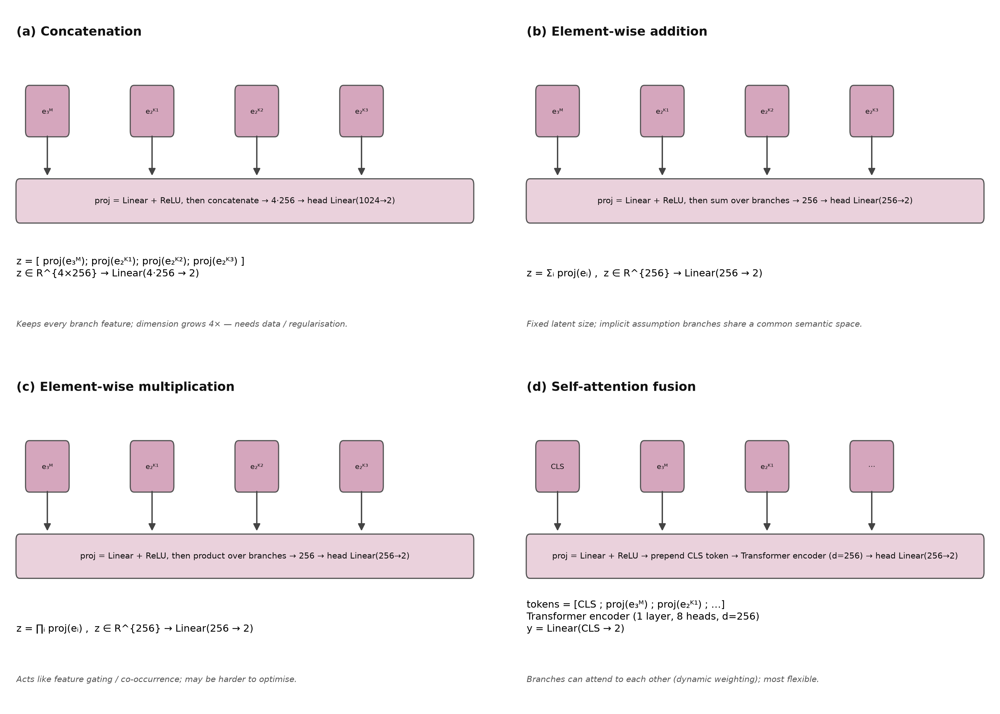

# Mô hình đa luồng Nhóm A (2D-projections + 3D)

> Tài liệu mô tả kiến trúc mô hình và cách nó hoạt động, dùng để trích vào báo cáo/luận văn.
> Hình minh hoạ nằm trong thư mục `figures/`.

## Hình tham chiếu

| Mô tả | File |
|---|---|
| Sơ đồ tổng thể mô hình đa luồng | `figures/model_multiview_overview.png` |
| 4 chế độ fusion (concat / add / mul / self-attention) | `figures/model_fusion_variants.png` |
| Ví dụ các view 2D (đầu vào nhánh 2D) từ 3 volume thật | `figures/report_2d_branch_inputs.png` |
| Bộ 6 panel "báo cáo" của 1 volume (glc+) | `figures/report_views_2404_glcplus.png` |

---

## 1. Ý tưởng chính

Một khối OCT 200³ chứa quá nhiều thông tin dư thừa theo chiều sâu (depth). Nhóm A **nén** khối 3D thành một số **ảnh 2D kiểu "báo cáo"** bằng phép chiếu đơn giản (không cần học sâu), rồi cho 3 mạng 2D (mỗi mạng một view) **song song** với mạng 3D đọc thẳng khối gốc. Bốn luồng thông tin (1×3D + 3×2D) sau đó được **kết hợp (fusion)** để đưa ra quyết định glôcôm.

## 2. Bước tiền xử lý — chiếu 2D (Group A)

Với mỗi volume `V` (200×200×200 uint8):

1. **Tự động tìm trục chiều sâu `d`**: tính biên dạng cường độ trung bình theo từng trục; trục có biến thiên lớn nhất chính là trục depth (trục chứa cấu trúc lớp võng mạc). Hoán vị volume về dạng chuẩn *"depth nằm ở trục cuối"* để mọi mẫu nhất quán.
2. **Xác định dải RNFL**: chiếu biên dạng theo depth, lấy đỉnh sáng nhất làm mốc, dải phân tích = `peak ± 16` lớp (dải lớp sợi thần kinh).
3. **Sinh 3 view en-face** (mỗi view 200×200, chuẩn hoá `/255`):

| View | Phép toán | Vai trò |
|---|---|---|
| `aip_full` | trung bình theo depth **toàn bộ** khối | ảnh nền kiểu SLO/fundus |
| `slab_aip` | trung bình theo depth **trong dải RNFL** | bản đồ phản xạ lớp sợi thần kinh |
| `slab_mip` | **max** theo depth trong dải RNFL | nhấn chi tiết sợi thần kinh/mạch |

Cả 3 đều là phép `mean`/`max` thuần NumPy — **không có tham số học** → chạy được ngay khi đọc dữ liệu.

## 3. Các nhánh mã hoá (branch)

### Nhánh 3D (`Enc3D`) — đầu vào `1×200×200×200`

- Stem: Conv3d `1→24` + GroupNorm + ReLU.
- 4 khối residual: kênh `24→48→96→192`, dùng **GroupNorm** thay BatchNorm (batch nhỏ 2–4 làm BN kém ổn định).
- **Pool không đối xứng**: các tầng đầu chỉ giảm 2 chiều ngang `(2,2,1)`; chiều sâu (nơi có lớp RNFL mỏng) chỉ giảm về cuối — tránh "nghiền nát" lớp RNFL.
- Kết thúc bằng **Global Average Pool (GAP)** → vector đặc trưng **e₃D ∈ ℝ¹⁹²**.

### Ba nhánh 2D (`Enc2D × 3`) — mỗi view `1×200×200` đi vào một mạng riêng

- Kiến trúc kiểu ResNet-18: stem Conv2d `1→64` + 4 giai đoạn residual `64→128→256→512` (2 block/giai đoạn), GroupNorm, **không dùng pretrain ImageNet** (huấn luyện từ đầu để so sánh công bằng).
- GAP → **e₂Dⁱ ∈ ℝ⁵¹²**, `i = 1, 2, 3`.
- Quan trọng: 3 nhánh **cùng kiến trúc nhưng trọng số độc lập** — mỗi view học đặc trưng riêng, không chia sẻ tham số.

## 4. Bộ fusion (khảo sát 4 phép)

Mọi embedding được chiếu về **không gian chung 256 chiều**: `proj(e) = ReLU(Linear(· → 256))`, riêng từng luồng. Sau đó áp một trong 4 phép toán:

| Phép | Công thức | Ý nghĩa |
|---|---|---|
| **Concat** | `z = [p₃D; p₂D¹; p₂D²; p₂D³]`, `z ∈ ℝ¹⁰²⁴` | giữ nguyên mọi chiều, mất thông tin ít nhất |
| **Add** | `z = Σᵢ pᵢ`, `z ∈ ℝ²⁵⁶` | cộng đồng nhất các không gian đặc trưng |
| **Mul** | `z = Πᵢ pᵢ`, `z ∈ ℝ²⁵⁶` | kiểu "cổng" (gate) — chỉ giữ đặc trưng đồng xuất hiện |
| **Self-attention** | thêm token `[CLS]` + 4 token `pᵢ`, qua Transformer encoder (1 lớp, 8 head, d = 256, FFN 512), lấy `CLS` | các luồng "nhìn nhau" để tự trọng số hoá động |

Cuối cùng **head**: `Linear → 2 logits` (no-glaucoma / glaucoma), mất mát **CrossEntropy**.

## 5. Baselines để so sánh (ablation)

- `single3d`: bỏ toàn bộ nhánh 2D, head gắn thẳng lên `e₃D`.
- `single2dⁱ`: chỉ giữ đúng 1 view thứ `i`.

→ Cho biết *mỗi view đóng góp bao nhiêu* và *việc kết hợp có lợi hơn từng luồng đơn lẻ hay không*.

## 6. Huấn luyện & chi phí

- AdamW (lr tỉ lệ `√(effective_bs/4)`, wd 1e-4), cosine schedule, AMP (GPU), grad-accum (effective bs = 2×8 = 16), early-stop trên val, đánh giá test ở epoch tốt nhất.
- Số tham số đo từ code: Enc3D ≈ **2.0M**, mỗi Enc2D ≈ **11.2M**, toàn mô hình fusion ≈ **36.5M**.
- Độ dài embedding vào fusion: 1×192 + 3×512.
- Mỗi run log lên **wandb (project `glaucoma-thesis`)**: val/test acc, precision, recall, F1.

## 7. Giả thuyết khoa học đưa vào báo cáo

Nếu các view 2D (đặc biệt `slab_aip`/`slab_mip`) chứa tín hiệu bổ trợ không nằm trong cách 3D đọc thẳng (ví dụ tương phản theo vùng quanh gai thị), thì các fusion `concat`/`attn` có thể **vượt `single3d`** dù chỉ thêm trọng số nhỏ — và `attn` sẽ tự quyết luồng nào quan trọng. Kết quả cần đối chiếu đúng trên cùng tập val/test để tránh lạm phát do chọn mô hình.

---

*Tài liệu được sinh từ mô tả kiến trúc trong `notebooks/3d_glaucoma_multiview_2d3d.ipynb`; hình vẽ tái lập bằng `scripts/render_multiview_model_diagram.py` và `scripts/render_report_views.py`.*
